## Giriş

- Örneklere dayalı dil öğrenme
	- Yabancı dil
	- Gramer kurallarını zihin kendisi çıkartır
		- Stephen Krashen'ın yabancı dil öğrenme teorisi:
			[http://www.sk.com.br/sk-krash-english.html](http://www.sk.com.br/sk-krash-english.html)
	  - Öğrenmek daha zevkli: zorlanma - kolaylık dengesi

--- .class #id 

## Veri Bilimi Nedir?

- Disiplinler arası bir alan
  - Programlama
  - İstatistik
  - Alan uzmanlığı - analiz

--- .class #id 

## Veri Bilimi Nedir?


--- .class #id 

## New York Uçuş Verisi

- Veri kaynağı
	- [http://datascience.la/hadley-wickhams-dplyr-tutorial-at-user-2014-part-1/](http://datascience.la/hadley-wickhams-dplyr-tutorial-at-user-2014-part-1/)
	- csv dosyaları
	- [https://github.com/mertnuhoglu/r_verigazeteciligi](https://github.com/mertnuhoglu/r_verigazeteciligi) 
- Verileri yükleme


```r
	 library(data.table)
	 flights = fread("flights.csv")
	 airports = fread("airports.csv")
	 planes = fread("planes.csv")
	 weather = fread("weather.csv")
```

--- .class #id 

## Verileri Gözden Geçirme


```r
	 str(flights)
```

```
## Classes 'data.table' and 'data.frame':	227496 obs. of  14 variables:
##  $ date     : chr  "2011-01-01 12:00:00" "2011-01-02 12:00:00" "2011-01-03 12:00:00" "2011-01-04 12:00:00" ...
##  $ hour     : int  14 14 13 14 14 13 13 13 14 14 ...
##  $ minute   : int  0 1 52 3 5 59 59 55 43 43 ...
##  $ dep      : int  1400 1401 1352 1403 1405 1359 1359 1355 1443 1443 ...
##  $ arr      : int  1500 1501 1502 1513 1507 1503 1509 1454 1554 1553 ...
##  $ dep_delay: int  0 1 -8 3 5 -1 -1 -5 43 43 ...
##  $ arr_delay: int  -10 -9 -8 3 -3 -7 -1 -16 44 43 ...
##  $ carrier  : chr  "AA" "AA" "AA" "AA" ...
##  $ flight   : int  428 428 428 428 428 428 428 428 428 428 ...
##  $ dest     : chr  "DFW" "DFW" "DFW" "DFW" ...
##  $ plane    : chr  "N576AA" "N557AA" "N541AA" "N403AA" ...
##  $ cancelled: int  0 0 0 0 0 0 0 0 0 0 ...
##  $ time     : int  40 45 48 39 44 45 43 40 41 45 ...
##  $ dist     : int  224 224 224 224 224 224 224 224 224 224 ...
##  - attr(*, ".internal.selfref")=<externalptr>
```

--- .class #id 

## Verileri Gözden Geçirme (Alt.)

```
	 library(dplyr)
```


```r
	 tbl_df(flights)
```

```
## Source: local data frame [227,496 x 14]
## 
##                   date hour minute  dep  arr dep_delay arr_delay carrier
## 1  2011-01-01 12:00:00   14      0 1400 1500         0       -10      AA
## 2  2011-01-02 12:00:00   14      1 1401 1501         1        -9      AA
## 3  2011-01-03 12:00:00   13     52 1352 1502        -8        -8      AA
## 4  2011-01-04 12:00:00   14      3 1403 1513         3         3      AA
## 5  2011-01-05 12:00:00   14      5 1405 1507         5        -3      AA
## 6  2011-01-06 12:00:00   13     59 1359 1503        -1        -7      AA
## 7  2011-01-07 12:00:00   13     59 1359 1509        -1        -1      AA
## 8  2011-01-08 12:00:00   13     55 1355 1454        -5       -16      AA
## 9  2011-01-09 12:00:00   14     43 1443 1554        43        44      AA
## 10 2011-01-10 12:00:00   14     43 1443 1553        43        43      AA
## ..                 ...  ...    ...  ...  ...       ...       ...     ...
## Variables not shown: flight (int), dest (chr), plane (chr), cancelled
##   (int), time (int), dist (int)
```

--- .class #id 

## Diğer Veriler


```r
	 tbl_df(weather)
```

```
## Source: local data frame [8,723 x 14]
## 
##          date hour temp dew_point humidity pressure visibility wind_dir
## 1  2011-01-01    0 59.0      28.9       32    29.86         10      NNE
## 2  2011-01-01    1 57.2      28.4       33    29.88         10      NNE
## 3  2011-01-01    2 55.4      28.4       36    29.93         10      NNW
## 4  2011-01-01    3 53.6      28.4       38    29.94         10    North
## 5  2011-01-01    4   NA        NA       NA    29.99         10      NNW
## 6  2011-01-01    5   NA        NA       NA    30.02         10    North
## 7  2011-01-01    6 53.1      17.1       24    30.05         10    North
## 8  2011-01-01    7 53.1      16.0       23    30.07         10    North
## 9  2011-01-01    8 54.0      18.0       24    30.09         10    North
## 10 2011-01-01    9 55.4      17.6       23    30.09         10      NNE
## ..        ...  ...  ...       ...      ...      ...        ...      ...
## Variables not shown: wind_dir2 (int), wind_speed (dbl), gust_speed (dbl),
##   precip (dbl), conditions (chr), events (chr)
```

--- .class #id 

## Diğer Veriler


```r
	 tbl_df(planes)
```

```
## Source: local data frame [2,853 x 9]
## 
##     plane year               mfr          model no.eng no.seats speed
## 1  N576AA 1991 MCDONNELL DOUGLAS DC-9-82(MD-82)      2      172    NA
## 2  N557AA 1993        MARZ BARRY      KITFOX IV      1        2    NA
## 3  N403AA 1974             RAVEN           S55A     NA        1    60
## 4  N492AA 1989 MCDONNELL DOUGLAS DC-9-82(MD-82)      2      172    NA
## 5  N262AA 1985 MCDONNELL DOUGLAS DC-9-82(MD-82)      2      172    NA
## 6  N493AA 1989 MCDONNELL DOUGLAS DC-9-82(MD-82)      2      172    NA
## 7  N477AA 1988 MCDONNELL DOUGLAS DC-9-82(MD-82)      2      172    NA
## 8  N476AA 1988 MCDONNELL DOUGLAS DC-9-82(MD-82)      2      172    NA
## 9  N504AA   NA AUTHIER ANTHONY P      TIERRA II      1        2    NA
## 10 N565AA 1987 MCDONNELL DOUGLAS DC-9-83(MD-83)      2      172    NA
## ..    ...  ...               ...            ...    ...      ...   ...
## Variables not shown: engine (chr), type (chr)
```

--- .class #id 

## Diğer Veriler


```r
	 tbl_df(airports)
```

```
## Source: local data frame [3,376 x 7]
## 
##    iata              airport             city state country      lat
## 1   00M             Thigpen       Bay Springs    MS     USA 31.95376
## 2   00R Livingston Municipal       Livingston    TX     USA 30.68586
## 3   00V          Meadow Lake Colorado Springs    CO     USA 38.94575
## 4   01G         Perry-Warsaw            Perry    NY     USA 42.74135
## 5   01J     Hilliard Airpark         Hilliard    FL     USA 30.68801
## 6   01M    Tishomingo County          Belmont    MS     USA 34.49167
## 7   02A          Gragg-Wade           Clanton    AL     USA 32.85049
## 8   02C              Capitol       Brookfield    WI     USA 43.08751
## 9   02G    Columbiana County   East Liverpool    OH     USA 40.67331
## 10  03D     Memphis Memorial          Memphis    MO     USA 40.44726
## ..  ...                  ...              ...   ...     ...      ...
## Variables not shown: long (dbl)
```

--- .class #id 

## Row Index (Satır No)


```r
	 flights[3]
```

```
##                   date hour minute  dep  arr dep_delay arr_delay carrier
## 1: 2011-01-03 12:00:00   13     52 1352 1502        -8        -8      AA
##    flight dest  plane cancelled time dist
## 1:    428  DFW N541AA         0   48  224
```


```r
	 flights[5]
```

```
##                   date hour minute  dep  arr dep_delay arr_delay carrier
## 1: 2011-01-05 12:00:00   14      5 1405 1507         5        -3      AA
##    flight dest  plane cancelled time dist
## 1:    428  DFW N492AA         0   44  224
```

--- .class #id 

## Head (Baş Kısım)


```r
	 head(flights)
```

```
##                   date hour minute  dep  arr dep_delay arr_delay carrier
## 1: 2011-01-01 12:00:00   14      0 1400 1500         0       -10      AA
## 2: 2011-01-02 12:00:00   14      1 1401 1501         1        -9      AA
## 3: 2011-01-03 12:00:00   13     52 1352 1502        -8        -8      AA
## 4: 2011-01-04 12:00:00   14      3 1403 1513         3         3      AA
## 5: 2011-01-05 12:00:00   14      5 1405 1507         5        -3      AA
## 6: 2011-01-06 12:00:00   13     59 1359 1503        -1        -7      AA
##    flight dest  plane cancelled time dist
## 1:    428  DFW N576AA         0   40  224
## 2:    428  DFW N557AA         0   45  224
## 3:    428  DFW N541AA         0   48  224
## 4:    428  DFW N403AA         0   39  224
## 5:    428  DFW N492AA         0   44  224
## 6:    428  DFW N262AA         0   45  224
```

--- .class #id 

## Head (Baş Kısım) (Alt.)


```r
	 flights[1:5]
```

```
##                   date hour minute  dep  arr dep_delay arr_delay carrier
## 1: 2011-01-01 12:00:00   14      0 1400 1500         0       -10      AA
## 2: 2011-01-02 12:00:00   14      1 1401 1501         1        -9      AA
## 3: 2011-01-03 12:00:00   13     52 1352 1502        -8        -8      AA
## 4: 2011-01-04 12:00:00   14      3 1403 1513         3         3      AA
## 5: 2011-01-05 12:00:00   14      5 1405 1507         5        -3      AA
##    flight dest  plane cancelled time dist
## 1:    428  DFW N576AA         0   40  224
## 2:    428  DFW N557AA         0   45  224
## 3:    428  DFW N541AA         0   48  224
## 4:    428  DFW N403AA         0   39  224
## 5:    428  DFW N492AA         0   44  224
```

--- .class #id 

## Range (Aralık) 


```r
	 flights[30:32]
```

```
##                   date hour minute  dep  arr dep_delay arr_delay carrier
## 1: 2011-01-30 12:00:00   13     59 1359 1456        -1       -14      AA
## 2: 2011-01-31 12:00:00   14     41 1441 1553        41        43      AA
## 3: 2011-01-01 12:00:00    7     28  728  840         8         5      AA
##    flight dest  plane cancelled time dist
## 1:    428  DFW N561AA         0   39  224
## 2:    428  DFW N505AA         0   39  224
## 3:    460  DFW N520AA         0   41  224
```

--- .class #id 

## Tail (Son Kısım) 


```r
	 tail(flights)
```

```
##                   date hour minute  dep  arr dep_delay arr_delay carrier
## 1: 2011-12-06 12:00:00   13      7 1307 1600         7         0      WN
## 2: 2011-12-06 12:00:00   18     18 1818 2111         8        -9      WN
## 3: 2011-12-06 12:00:00   20     47 2047 2334         7         4      WN
## 4: 2011-12-06 12:00:00    9     12  912 1031        -3        -4      WN
## 5: 2011-12-06 12:00:00    6     56  656  812        -4       -13      WN
## 6: 2011-12-06 12:00:00   16      0 1600 1713         0       -12      WN
##    flight dest  plane cancelled time dist
## 1:    471  TPA N632SW         0   98  781
## 2:   1191  TPA N284WN         0   97  781
## 3:   1674  TPA N366SW         0   94  781
## 4:    127  TUL N777QC         0   61  453
## 5:    621  TUL N727SW         0   64  453
## 6:   1597  TUL N745SW         0   59  453
```

--- .class #id 

## RStudio

```
	setwd("/Users/mertnuhoglu/projects/dewey/r_verigazeteciligi")
	library(data.table)
	flights = fread("flights.csv")
	View(flights)
```

--- .class #id 

## RStudio

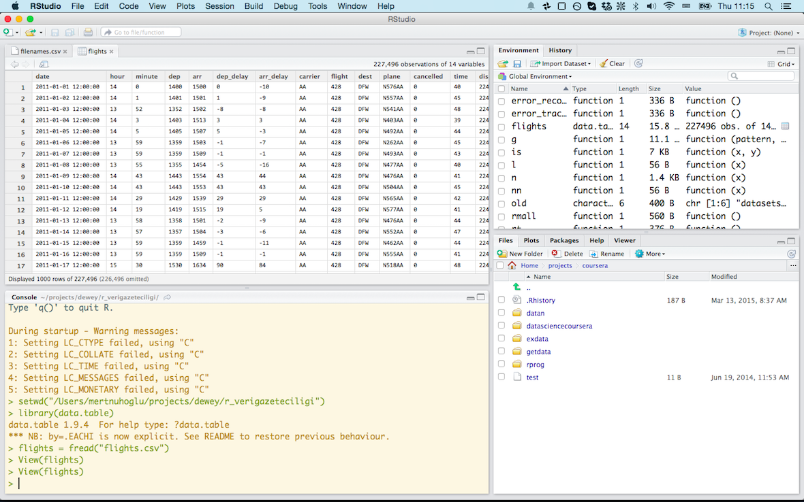

--- .class #id 

## Columns (Kolonlar)


```r
	 names(flights)
```

```
##  [1] "date"      "hour"      "minute"    "dep"       "arr"      
##  [6] "dep_delay" "arr_delay" "carrier"   "flight"    "dest"     
## [11] "plane"     "cancelled" "time"      "dist"
```


```r
	 str(flights)
```

```
## Classes 'data.table' and 'data.frame':	227496 obs. of  14 variables:
##  $ date     : chr  "2011-01-01 12:00:00" "2011-01-02 12:00:00" "2011-01-03 12:00:00" "2011-01-04 12:00:00" ...
##  $ hour     : int  14 14 13 14 14 13 13 13 14 14 ...
##  $ minute   : int  0 1 52 3 5 59 59 55 43 43 ...
##  $ dep      : int  1400 1401 1352 1403 1405 1359 1359 1355 1443 1443 ...
##  $ arr      : int  1500 1501 1502 1513 1507 1503 1509 1454 1554 1553 ...
##  $ dep_delay: int  0 1 -8 3 5 -1 -1 -5 43 43 ...
##  $ arr_delay: int  -10 -9 -8 3 -3 -7 -1 -16 44 43 ...
##  $ carrier  : chr  "AA" "AA" "AA" "AA" ...
##  $ flight   : int  428 428 428 428 428 428 428 428 428 428 ...
##  $ dest     : chr  "DFW" "DFW" "DFW" "DFW" ...
##  $ plane    : chr  "N576AA" "N557AA" "N541AA" "N403AA" ...
##  $ cancelled: int  0 0 0 0 0 0 0 0 0 0 ...
##  $ time     : int  40 45 48 39 44 45 43 40 41 45 ...
##  $ dist     : int  224 224 224 224 224 224 224 224 224 224 ...
##  - attr(*, ".internal.selfref")=<externalptr>
```

--- .class #id 

## Satır ve Kolon


```r
	 flights[5]$flight
```

```
## [1] 428
```


```r
	 flights[5][['flight']]
```

```
## [1] 428
```

--- .class #id 

## Filter (Sorgulama)


```r
	 filter(flights, dest == "SFO")
```

```
##                      date hour minute  dep  arr dep_delay arr_delay
##    1: 2011-01-31 12:00:00    8     51  851 1052         1       -27
##    2: 2011-01-31 12:00:00   11     29 1129 1351         4         1
##    3: 2011-01-31 12:00:00   14     32 1432 1656         7         5
##    4: 2011-01-31 12:00:00   17     48 1748 2001         3        -4
##    5: 2011-01-31 12:00:00   21     43 2143 2338        50        24
##   ---                                                              
## 2814: 2011-12-27 12:00:00   NA     NA   NA   NA        NA        NA
## 2815: 2011-12-28 12:00:00    9      6  906 1125         1        -7
## 2816: 2011-12-29 12:00:00    9     41  941 1152        36        20
## 2817: 2011-12-30 12:00:00    9     25  925 1142        20        10
## 2818: 2011-12-31 12:00:00    9      5  905 1108         0       -24
##       carrier flight dest  plane cancelled time dist
##    1:      CO    170  SFO N35407         0  225 1635
##    2:      CO    270  SFO N37420         0  228 1635
##    3:      CO    370  SFO N27213         0  229 1635
##    4:      CO    570  SFO N75436         0  236 1635
##    5:      CO    770  SFO N37281         0  224 1635
##   ---                                               
## 2814:      UA    855  SFO                1   NA 1635
## 2815:      UA    855  SFO N669UA         0  222 1635
## 2816:      UA    855  SFO N664UA         0  225 1635
## 2817:      UA    855  SFO N539UA         0  226 1635
## 2818:      UA    855  SFO N665UA         0  213 1635
```

--- .class #id 

## Filter (Sorgulama) (Alt.)


```r
	 flights %>%
			filter(dest == "SFO") 
```

```
##                      date hour minute  dep  arr dep_delay arr_delay
##    1: 2011-01-31 12:00:00    8     51  851 1052         1       -27
##    2: 2011-01-31 12:00:00   11     29 1129 1351         4         1
##    3: 2011-01-31 12:00:00   14     32 1432 1656         7         5
##    4: 2011-01-31 12:00:00   17     48 1748 2001         3        -4
##    5: 2011-01-31 12:00:00   21     43 2143 2338        50        24
##   ---                                                              
## 2814: 2011-12-27 12:00:00   NA     NA   NA   NA        NA        NA
## 2815: 2011-12-28 12:00:00    9      6  906 1125         1        -7
## 2816: 2011-12-29 12:00:00    9     41  941 1152        36        20
## 2817: 2011-12-30 12:00:00    9     25  925 1142        20        10
## 2818: 2011-12-31 12:00:00    9      5  905 1108         0       -24
##       carrier flight dest  plane cancelled time dist
##    1:      CO    170  SFO N35407         0  225 1635
##    2:      CO    270  SFO N37420         0  228 1635
##    3:      CO    370  SFO N27213         0  229 1635
##    4:      CO    570  SFO N75436         0  236 1635
##    5:      CO    770  SFO N37281         0  224 1635
##   ---                                               
## 2814:      UA    855  SFO                1   NA 1635
## 2815:      UA    855  SFO N669UA         0  222 1635
## 2816:      UA    855  SFO N664UA         0  225 1635
## 2817:      UA    855  SFO N539UA         0  226 1635
## 2818:      UA    855  SFO N665UA         0  213 1635
```

--- .class #id 

## Filter (Sorgulama) (Alt.)


```r
	 flights %>%
			filter(dest == "SFO") %>%
			filter(time <= 220)
```

```
##                      date hour minute  dep  arr dep_delay arr_delay
##    1: 2011-01-29 12:00:00   18      9 1809 2021        14        11
##    2: 2011-01-28 12:00:00   14     29 1429 1640         4       -11
##    3: 2011-01-28 12:00:00   21      0 2100 2301       129       102
##    4: 2011-01-28 12:00:00   16      4 1604 1830         4        10
##    5: 2011-01-27 12:00:00    8     57  857 1053         7       -26
##   ---                                                              
## 1249: 2011-12-23 12:00:00    9     20  920 1132        15         0
## 1250: 2011-12-24 12:00:00    9      2  902 1109        -3       -23
## 1251: 2011-12-25 12:00:00    9      5  905 1101         0       -31
## 1252: 2011-12-26 12:00:00    9     25  925 1132        20         0
## 1253: 2011-12-31 12:00:00    9      5  905 1108         0       -24
##       carrier flight dest  plane cancelled time dist
##    1:      CO    570  SFO N73406         0  217 1635
##    2:      CO    370  SFO N12238         0  212 1635
##    3:      CO    670  SFO N39418         0  220 1635
##    4:      CO   1070  SFO N35407         0  217 1635
##    5:      CO    170  SFO N71411         0  212 1635
##   ---                                               
## 1249:      UA    855  SFO N677UA         0  213 1635
## 1250:      UA    855  SFO N672UA         0  202 1635
## 1251:      UA    855  SFO N668UA         0  206 1635
## 1252:      UA    855  SFO N673UA         0  215 1635
## 1253:      UA    855  SFO N665UA         0  213 1635
```

--- .class #id 

## Filter (Sorgulama) (Alt.)


```r
	 flights %>%
			filter(dest == "SFO") %>%
			filter(time <= 220) %>%
			filter(date > "2011-12-23") %>%
			filter(date < "2011-12-26")
```

```
##                    date hour minute  dep  arr dep_delay arr_delay carrier
##  1: 2011-12-25 12:00:00   18     40 1840 2027        65        22      CO
##  2: 2011-12-25 12:00:00   12     53 1253 1442        98        53      CO
##  3: 2011-12-25 12:00:00   21      4 2104 2256         4       -24      CO
##  4: 2011-12-25 12:00:00   14     29 1429 1628        -1       -29      CO
##  5: 2011-12-24 12:00:00   17     49 1749 1945        12       -26      CO
##  6: 2011-12-24 12:00:00   16     33 1633 1834        23       -10      CO
##  7: 2011-12-24 12:00:00   12      9 1209 1346        54        -3      CO
##  8: 2011-12-24 12:00:00   21     17 2117 2258         2       -51      CO
##  9: 2011-12-24 12:00:00   14     31 1431 1613         1       -51      CO
## 10: 2011-12-23 12:00:00   21      7 2107 2300       137       102      CO
## 11: 2011-12-23 12:00:00   17     50 1750 1956        15        -9      CO
## 12: 2011-12-23 12:00:00   16     11 1611 1813         1       -25      CO
## 13: 2011-12-23 12:00:00   21     27 2127 2318        12       -21      CO
## 14: 2011-12-24 12:00:00    7     26  726  928        -4       -29      UA
## 15: 2011-12-25 12:00:00    7     28  728  923        -2       -34      UA
## 16: 2011-12-24 12:00:00   19      3 1903 2048        13       -31      UA
## 17: 2011-12-23 12:00:00    9     20  920 1132        15         0      UA
## 18: 2011-12-24 12:00:00    9      2  902 1109        -3       -23      UA
## 19: 2011-12-25 12:00:00    9      5  905 1101         0       -31      UA
##     flight dest  plane cancelled time dist
##  1:   1181  SFO N75435         0  206 1635
##  2:   1669  SFO N37408         0  207 1635
##  3:   1712  SFO N57864         0  213 1635
##  4:   1737  SFO N35271         0  217 1635
##  5:   1181  SFO N14231         0  214 1635
##  6:   1240  SFO N24202         0  213 1635
##  7:   1669  SFO N73406         0  201 1635
##  8:   1712  SFO N74856         0  200 1635
##  9:   1737  SFO N73860         0  204 1635
## 10:   1033  SFO N37267         0  211 1635
## 11:   1181  SFO N77867         0  218 1635
## 12:   1240  SFO N34222         0  217 1635
## 13:   1712  SFO N57863         0  213 1635
## 14:    567  SFO N498UA         0  214 1635
## 15:    567  SFO N490UA         0  210 1635
## 16:    576  SFO N483UA         0  205 1635
## 17:    855  SFO N677UA         0  213 1635
## 18:    855  SFO N672UA         0  202 1635
## 19:    855  SFO N668UA         0  206 1635
```

--- .class #id 

## Group By (Gruplama)


```r
	 flights %>%
			group_by(date) %>%
			summarize(
				 dep = mean(dep_delay, na.rm = T),
				 arr = mean(arr_delay, na.rm = T)
			)
```

```
## Source: local data table [365 x 3]
## 
##                   date       dep       arr
## 1  2011-01-01 12:00:00 10.708029 10.067642
## 2  2011-01-02 12:00:00 15.661169 10.509745
## 3  2011-01-03 12:00:00 13.414286  6.038627
## 4  2011-01-04 12:00:00 11.903614  7.970740
## 5  2011-01-05 12:00:00  6.325383  4.172650
## 6  2011-01-06 12:00:00  5.283333  6.069909
## 7  2011-01-07 12:00:00  5.365152  3.907295
## 8  2011-01-08 12:00:00  7.655311  3.070140
## 9  2011-01-09 12:00:00 20.748709 17.254325
## 10 2011-01-10 12:00:00 12.322061 11.040388
## ..                 ...       ...       ...
```

--- .class #id 

## NA (Not Available) Veriler


```r
	 x = c(4, 5, 7)
	 sum(x)
```

```
## [1] 16
```


```r
	 x = c(4, 5, 7, NA)
	 sum(x)
```

```
## [1] NA
```


```r
	 x = c(4, 5, 7, NA)
	 sum(x, na.rm = T)
```

```
## [1] 16
```

--- .class #id 

## sum (toplama) (Alt: Pipe kullanarak)


```r
	 x = c(4, 5, 7)
	 x %>% 
			sum()
```

```
## [1] 16
```


```r
	 x = c(4, 5, 7)
	 x %>% 
			sum
```

```
## [1] 16
```


```r
	 x = c(4, 5, 7, NA)
	 x %>% 
			sum(na.rm = T)
```

```
## [1] 16
```

--- .class #id 

## sum (toplama) (Alt: Pipe kullanarak)


```r
	 x = c(4, 5, 7, NA)
	 x %>% 
			is.na
```

```
## [1] FALSE FALSE FALSE  TRUE
```


```r
	 x = c(4, 5, 7, NA)
	 x %>% 
			is.na(.)
```

```
## [1] FALSE FALSE FALSE  TRUE
```

--- .class #id 

## Help (Yardım)

```
	 ?is.na
	 ?sum
```

--- .class #id 

## Subsetting


```r
	 x = c(4, 5, 7)
	 x > 5
```

```
## [1] FALSE FALSE  TRUE
```

```r
	 x[ c(F, F, T) ]
```

```
## [1] 7
```

```r
	 x[ x > 5 ]
```

```
## [1] 7
```

--- .class #id 

## Subsetting ve logical operatörler


```r
	 x = c(4, 5, 7, 9, 11)
	 x > 5 & x < 10
```

```
## [1] FALSE FALSE  TRUE  TRUE FALSE
```

```r
	 x[ c(F, F, T, T, F) ]
```

```
## [1] 7 9
```

```r
	 x[ x > 5 & x < 10 ]
```

```
## [1] 7 9
```

--- .class #id 

## is.na ile subsetting

- Kaç tane NA değer var?


```r
	 x = c(4, 5, 7, NA)
	 is.na(x)
```

```
## [1] FALSE FALSE FALSE  TRUE
```

```r
	 sum( c(F, F, F, T) )
```

```
## [1] 1
```

```r
	 sum( is.na( x ) )
```

```
## [1] 1
```

--- .class #id 

## is.na + pipes


```r
	 sum( is.na( x ) )
```

```
## [1] 1
```

```r
	 x %>% 
			is.na %>%
			sum
```

```
## [1] 1
```

--- .class #id 

## is.na ile subsetting

- NA'leri nasıl filtreleriz?


```r
	 library("magrittr")
	 x = c(4, 5, 7, NA)
	 x %>% 
			is.na(.) %>%
			not
```

```
## [1]  TRUE  TRUE  TRUE FALSE
```


```r
	 !is.na(x)
```

```
## [1]  TRUE  TRUE  TRUE FALSE
```

```r
	 not(is.na(x))
```

```
## [1]  TRUE  TRUE  TRUE FALSE
```

--- .class #id 

## is.na ile subsetting

- NA'leri nasıl filtreleriz?


```r
	 x = c(4, 5, 7, NA)
	 !is.na(x)
```

```
## [1]  TRUE  TRUE  TRUE FALSE
```

```r
	 x[!is.na(x)]
```

```
## [1] 4 5 7
```

```r
	 x[c(T, T, T, F)]
```

```
## [1] 4 5 7
```

--- .class #id 

## Fonksiyonları nereden bulacağız?

- Let me google that for you

```
	 http://lmgtfy.com/?q=r+mean+of+numbers
```

--- .class #id 

## Library'lerin (kütüphane) kapsamları

- http://lmgtfy.com/?q=r+dplyr

- Dahili kütüphaneler için:

	- http://adv-r.had.co.nz/Vocabulary.html

--- .class #id 

## Operatörlerle ilgili yardım?

- Her şey bir fonksiyon

```
	 ?"if"
	 ?"%>%"
```

--- .class #id 

## Group By (Gruplama)


```r
	 flights %>%
			group_by(date) %>%
			summarize(
				 dep = mean(dep_delay, na.rm = T),
				 arr = mean(arr_delay, na.rm = T),
				 over_15 = mean(dep_delay > 15),
				 over_15_total = sum(dep_delay > 15)
			)
```

```
## Source: local data table [365 x 5]
## 
##                   date       dep       arr   over_15 over_15_total
## 1  2011-01-01 12:00:00 10.708029 10.067642        NA            NA
## 2  2011-01-02 12:00:00 15.661169 10.509745        NA            NA
## 3  2011-01-03 12:00:00 13.414286  6.038627        NA            NA
## 4  2011-01-04 12:00:00 11.903614  7.970740        NA            NA
## 5  2011-01-05 12:00:00  6.325383  4.172650        NA            NA
## 6  2011-01-06 12:00:00  5.283333  6.069909 0.1257576            83
## 7  2011-01-07 12:00:00  5.365152  3.907295        NA            NA
## 8  2011-01-08 12:00:00  7.655311  3.070140        NA            NA
## 9  2011-01-09 12:00:00 20.748709 17.254325        NA            NA
## 10 2011-01-10 12:00:00 12.322061 11.040388        NA            NA
## ..                 ...       ...       ...       ...           ...
```

--- .class #id 

## Boş verileri (NA) filtreleme


```r
	 flights %>%
			group_by(date) %>%
			filter(!is.na(dep_delay)) %>%
			filter(!is.na(arr_delay)) %>%
			summarize(
				 dep = mean(dep_delay),
				 arr = mean(arr_delay),
				 over_15 = mean(dep_delay > 15),
				 over_15_total = sum(dep_delay > 15)
			)
```

```
## Source: local data table [365 x 5]
## 
##                   date       dep       arr   over_15 over_15_total
## 1  2011-01-01 12:00:00 10.667276 10.067642 0.2431444           133
## 2  2011-01-02 12:00:00 15.661169 10.509745 0.3178411           212
## 3  2011-01-03 12:00:00 13.442060  6.038627 0.2718169           190
## 4  2011-01-04 12:00:00 11.903614  7.970740 0.2891566           168
## 5  2011-01-05 12:00:00  6.328205  4.172650 0.1521368            89
## 6  2011-01-06 12:00:00  5.293313  6.069909 0.1261398            83
## 7  2011-01-07 12:00:00  5.270517  3.907295 0.1382979            91
## 8  2011-01-08 12:00:00  7.655311  3.070140 0.2004008           100
## 9  2011-01-09 12:00:00 20.814879 17.254325 0.4498270           260
## 10 2011-01-10 12:00:00 12.337641 11.040388 0.2714055           168
## ..                 ...       ...       ...       ...           ...
```

--- .class #id 

## Imposter syndrome (Kandırmaca ezikliği)

- Kimse her şeyi tam olarak anlayamaz
- Yetersizlik hissi her zaman burada
	 - Ne kadar öğrenirsen, o kadar fazla
- Dil bocalayarak öğrenilir
- Biraz kap, dene, hata yap, düzelt
- Nasıl düzelteceğiz?

--- .class #id 

## Kendi başımıza nasıl düzelteceğiz?

- http://stackoverflow.com

- Sorularınıza en fazla 5 dakika içinde yanıt

- Ne kadar çok sorarsanız, o kadar çok öğrenirsiniz
- Soruyu yazarken, yanıtı bulursunuz

--- .class #id 

## Nasıl soru sormalı?

- Minimalist
- Yanlış:
	 - Elimde Gapminder verisi var. Bunun içindeki GSMH verilerini filtreleyip, ortalama yaşam süreleriyle birleştirmeye çalışıyorum. Ancak olmuyor. Ne yapmam lazım?
- Doğru:
	 - Elimde iki veri kümesi var. Bunları birleştirmek istiyorum. 
	 - Örnekleri şu şekilde (3-5 satır örnek veri)
	 - Bunları nasıl birleştirebilirim ve şu çıktıyı elde ederim (istenen çıktının verisi)

--- .class #id 

## Stackoverflow'daki sorular

- Tüm R soruları
	- http://stackoverflow.com/questions/tagged/r
- Örnekler:
	 - http://stackoverflow.com/questions/5992082/how-to-remove-all-whitespace-from-a-string
			- " xx yy 11 22  33 " will become "xxyy112233". How can I achieve this?
	 - http://stackoverflow.com/questions/1269624/how-to-get-row-from-r-dataframe
	 - http://stackoverflow.com/questions/29880423/how-to-write-a-subsetting-operation-in-magrittr-dplyr-xis-nax
	 - http://stackoverflow.com/questions/9749598/r-obtaining-month-and-year-from-a-date
	 - http://stackoverflow.com/questions/14458314/letter-y-comes-after-i-when-sorting-alphabetically

--- .class #id 

## Karmaşık içiçe işlemler


```r
	hourly_delay <- filter(
		summarise(
			group_by(
				filter(flights, !is.na(dep_delay)), 
				date, hour), 
			delay = mean(dep_delay), 
			n = n()), 
		n > 10
	)
	 hourly_delay
```

```
## Source: local data table [5,759 x 4]
## Groups: date
## 
##                   date hour     delay  n
## 1  2011-01-01 12:00:00   14  9.581395 43
## 2  2011-01-01 12:00:00    7  5.233333 30
## 3  2011-01-01 12:00:00   16 15.481481 27
## 4  2011-01-01 12:00:00   17 24.419355 31
## 5  2011-01-01 12:00:00   10  2.425532 47
## 6  2011-01-01 12:00:00   12  3.863636 44
## 7  2011-01-01 12:00:00   18 17.692308 39
## 8  2011-01-01 12:00:00    9  4.103448 29
## 9  2011-01-01 12:00:00   15  9.725000 40
## 10 2011-01-01 12:00:00   19 15.354839 62
## ..                 ...  ...       ... ..
```

--- .class #id 

## Pipeline ile sadeleştirme


```r
hourly_delay <- flights %>% 
	filter(!is.na(dep_delay)) %>%
	group_by(date, hour) %>%
	summarise(
		delay = mean(dep_delay),
		n = n()
	) %>% 
	filter(n > 10)
hourly_delay
```

```
## Source: local data table [5,759 x 4]
## Groups: date
## 
##                   date hour     delay  n
## 1  2011-01-01 12:00:00   14  9.581395 43
## 2  2011-01-01 12:00:00    7  5.233333 30
## 3  2011-01-01 12:00:00   16 15.481481 27
## 4  2011-01-01 12:00:00   17 24.419355 31
## 5  2011-01-01 12:00:00   10  2.425532 47
## 6  2011-01-01 12:00:00   12  3.863636 44
## 7  2011-01-01 12:00:00   18 17.692308 39
## 8  2011-01-01 12:00:00    9  4.103448 29
## 9  2011-01-01 12:00:00   15  9.725000 40
## 10 2011-01-01 12:00:00   19 15.354839 62
## ..                 ...  ...       ... ..
```

--- .class #id 

## Problem

- Ortalama varış gecikmesi en fazla olan uçuş destinasyonları nelerdir?


```r
flights %>%
  group_by(dest) %>%
  summarise(arr_delay = mean(arr_delay, na.rm = TRUE), n = n()) %>%
  arrange(desc(arr_delay))
```

```
## Source: local data table [116 x 3]
## 
##    dest arr_delay    n
## 1   ANC  26.08065  125
## 2   CID  17.80049  410
## 3   DSM  15.95110  647
## 4   SFO  14.89036 2818
## 5   BPT  14.33333    3
## 6   GRR  13.71729  677
## 7   DAY  13.67117  451
## 8   VPS  12.45718  880
## 9   ECP  12.42222  729
## 10  SAV  12.33137  863
## ..  ...       ...  ...
```

--- .class #id 

## Problem

- Havalimanı, sefer no ve destinasyona göre, tüm uçuşları grupladığımızda, 365 adet uçuş olan kombinasyonlar hangileridir?


```r
flights %>% 
  group_by(carrier, flight, dest) %>% 
  tally %>%
  filter(n == 365)
```

```
## Source: local data table [7 x 4]
## Groups: carrier, flight
## 
##   carrier flight dest   n
## 1      AA   1294  MIA 365
## 2      AS    731  SEA 365
## 3      CO      1  HNL 365
## 4      CO     62  EWR 365
## 5      CO     89  EWR 365
## 6      CO    106  EWR 365
## 7      MQ   3859  ORD 365
```

--- .class #id 

## Aynı problem alternatif çözüm


```r
flights %>% 
  group_by(carrier, flight, dest) %>% 
  filter(n() == 365)
```

```
## Source: local data table [2,555 x 14]
## Groups: carrier, flight, dest
## 
##                   date hour minute  dep  arr dep_delay arr_delay carrier
## 1  2011-01-01 12:00:00   17     56 1756 2112         1        -3      AA
## 2  2011-01-02 12:00:00   18     23 1823 2132        28        17      AA
## 3  2011-01-03 12:00:00   17     55 1755 2106         0        -9      AA
## 4  2011-01-04 12:00:00   17     57 1757 2122         2         7      AA
## 5  2011-01-05 12:00:00   17     51 1751 2100        -4       -15      AA
## 6  2011-01-06 12:00:00   17     46 1746 2120        -9         5      AA
## 7  2011-01-07 12:00:00   17     57 1757 2108         2        -7      AA
## 8  2011-01-08 12:00:00   17     49 1749 2100        -6       -15      AA
## 9  2011-01-09 12:00:00   18     10 1810 2123        15         8      AA
## 10 2011-01-10 12:00:00   19     34 1934 2235        99        80      AA
## ..                 ...  ...    ...  ...  ...       ...       ...     ...
## Variables not shown: flight (int), dest (chr), plane (chr), cancelled
##   (int), time (int), dist (int)
```

--- .class #id 

## Uçuş süresine bağlı olarak gecikmeler nasıl?

- Uçuş sürelerini hesapla. Bunlara göre tüm uçuşları gruplandır. Her gruptaki ortalama gecikmeyi ve toplam uçuş sayısını göster.


```r
per_hour <- flights %>%
  filter(cancelled == 0) %>%
  mutate(time = hour + minute / 60) %>%
  group_by(time) %>%
  summarise(arr_delay = mean(arr_delay, na.rm = TRUE), n = n())
per_hour
```

```
## Source: local data table [1,207 x 3]
## 
##        time arr_delay   n
## 1  14.00000  9.714976 207
## 2  14.01667 13.082278 158
## 3  13.86667 12.368421 152
## 4  14.05000 12.176136 176
## 5  14.08333  7.693642 173
## 6  13.98333 10.590164 183
## 7  13.91667  7.769663 178
## 8  14.71667  7.841424 310
## 9  14.48333  3.253589 418
## 10 14.31667  2.587662 308
## ..      ...       ... ...
```

--- .class #id 

## Tüm kayıtları csv olarak kaydet

```
install.packages("readr")
```

```
library("readr")
write_csv(per_hour, "per_hour.csv")
```

--- .class #id 

## 30'dan fazla uçuş yapan uçaklar hangileridir?


```r
flights %>%
  filter(!is.na(arr_delay)) %>%
  group_by(plane) %>%
	summarise(n = n()) %>%
  filter(n > 30) 
```

```
## Source: local data table [1,376 x 2]
## 
##     plane   n
## 1  N69063  81
## 2  N17245 264
## 3  N77520 238
## 4  N16647 337
## 5  N35204 253
## 6  N76522 234
## 7  N57870 265
## 8  N68159  44
## 9  N17126  45
## 10 N76529 188
## ..    ... ...
```

--- .class #id 

## 30'dan fazla uçuş yapan uçaklara ait uçuşlar hangileridir?


```r
planes = flights %>%
  filter(!is.na(arr_delay)) %>%
  group_by(plane) %>%
  filter(n() > 30) 
planes
```

```
## Source: local data table [205,944 x 14]
## Groups: plane
## 
##                   date hour minute  dep  arr dep_delay arr_delay carrier
## 1  2011-01-31 12:00:00    9     24  924 1413        -1        23      CO
## 2  2011-01-29 12:00:00   10     45 1045 1445        80        55      CO
## 3  2011-01-22 12:00:00    9     42  942 1340        17       -10      CO
## 4  2011-01-16 12:00:00    9     22  922 1343        -3        -7      CO
## 5  2011-01-09 12:00:00    9     56  956 1417        31        27      CO
## 6  2011-01-08 12:00:00   11     56 1156 1618        11         8      CO
## 7  2011-01-06 12:00:00    9     32  932 1402         7        12      CO
## 8  2011-01-04 12:00:00   11     44 1144 1619        -1         9      CO
## 9  2011-01-01 12:00:00    9     42  942 1356        17         6      CO
## 10 2011-02-20 12:00:00    9     31  931 1411         6        21      CO
## ..                 ...  ...    ...  ...  ...       ...       ...     ...
## Variables not shown: flight (int), dest (chr), plane (chr), cancelled
##   (int), time (int), dist (int)
```

--- .class #id 

## Bu uçuşların arasında 5 dk'dan daha az varış gecikmesi olanlar hangileri?


```r
planes %>% filter(arr_delay < 5)
```

```
## Source: local data table [128,610 x 14]
## Groups: plane
## 
##                   date hour minute  dep  arr dep_delay arr_delay carrier
## 1  2011-01-22 12:00:00    9     42  942 1340        17       -10      CO
## 2  2011-01-16 12:00:00    9     22  922 1343        -3        -7      CO
## 3  2011-02-17 12:00:00    9     26  926 1347         1        -3      CO
## 4  2011-02-12 12:00:00    9     32  932 1340         7       -10      CO
## 5  2011-02-05 12:00:00    9     31  931 1351         6         1      CO
## 6  2011-03-31 12:00:00   11     44 1144 1500        -1        -5      CO
## 7  2011-03-30 12:00:00   11     41 1141 1455        -4       -10      CO
## 8  2011-03-28 12:00:00    9     32  932 1258        -3         3      CO
## 9  2011-03-22 12:00:00   11     39 1139 1510        -6         0      CO
## 10 2011-03-20 12:00:00    9     33  933 1251         8         1      CO
## ..                 ...  ...    ...  ...  ...       ...       ...     ...
## Variables not shown: flight (int), dest (chr), plane (chr), cancelled
##   (int), time (int), dist (int)
```

--- .class #id 

## select (kolonları seçme)


```r
names(airports)
```

```
## [1] "iata"    "airport" "city"    "state"   "country" "lat"     "long"
```

```r
location <- airports %>% 
  select(dest = iata, name = airport, lat, long)
location
```

```
##       dest                      name      lat       long
##    1:  00M                  Thigpen  31.95376  -89.23450
##    2:  00R      Livingston Municipal 30.68586  -95.01793
##    3:  00V               Meadow Lake 38.94575 -104.56989
##    4:  01G              Perry-Warsaw 42.74135  -78.05208
##    5:  01J          Hilliard Airpark 30.68801  -81.90594
##   ---                                                   
## 3372:  ZEF           Elkin Municipal 36.28002  -80.78607
## 3373:  ZER Schuylkill Cty/Joe Zerbey 40.70645  -76.37315
## 3374:  ZPH     Zephyrhills Municipal 28.22806  -82.15592
## 3375:  ZUN                Black Rock 35.08323 -108.79178
## 3376:  ZZV      Zanesville Municipal 39.94446  -81.89211
```

--- .class #id 

## Destinasyonlara göre en çok varış gecikmeli uçuşlar


```r
flights %>%
  group_by(dest) %>%
  summarise(arr_delay = mean(arr_delay, na.rm = TRUE), n = n()) %>%
  arrange(desc(arr_delay)) 
```

```
## Source: local data table [116 x 3]
## 
##    dest arr_delay    n
## 1   ANC  26.08065  125
## 2   CID  17.80049  410
## 3   DSM  15.95110  647
## 4   SFO  14.89036 2818
## 5   BPT  14.33333    3
## 6   GRR  13.71729  677
## 7   DAY  13.67117  451
## 8   VPS  12.45718  880
## 9   ECP  12.42222  729
## 10  SAV  12.33137  863
## ..  ...       ...  ...
```

--- .class #id 

## Bu uçuşların destinasyonlarının lokasyon koordinatları?


```r
delays <- flights %>%
  group_by(dest) %>%
  summarise(arr_delay = mean(arr_delay, na.rm = TRUE), n = n()) %>%
  arrange(desc(arr_delay)) %>%
  inner_join(location, by="dest")
delays
```

```
## Source: local data table [114 x 6]
## 
##    dest  arr_delay    n                                name      lat
## 1   ABQ   7.226259 2812           Albuquerque International 35.04022
## 2   AEX   5.839437  724            Alexandria International 31.32737
## 3   AGS   4.000000    1                               Bush  33.36995
## 4   AMA   6.840095 1297              Amarillo International 35.21937
## 5   ANC  26.080645  125 Ted Stevens Anchorage International 61.17432
## 6   ASE   6.794643  125              Aspen-Pitkin Co/Sardy  39.22316
## 7   ATL   8.233251 7886   William B Hartsfield-Atlanta Intl 33.64044
## 8   AUS   7.448718 5022      Austin-Bergstrom International 30.19453
## 9   AVL   9.973988  350                  Asheville Regional 35.43619
## 10  BFL -13.198807  504                            Meadows  35.43360
## ..  ...        ...  ...                                 ...      ...
## Variables not shown: long (dbl)
```

--- .class #id 

## Koordinatları harita üzerinde gösterme


```r
library("ggplot2")
ggplot(delays, aes(long, lat)) + 
  borders("state") + 
  geom_point(aes(colour = arr_delay), size = 5, alpha = 0.9) + 
  scale_colour_gradient2() +
  coord_quickmap()
```

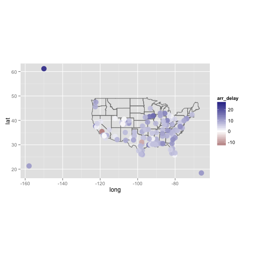 

--- .class #id 

## Bunların arasında erken varan uçuşlar hangileri?


```r
delays %>% filter(arr_delay < 0)
```

```
## Source: local data table [3 x 6]
## 
##   dest   arr_delay   n              name      lat      long
## 1  BFL -13.1988072 504          Meadows  35.43360 -119.0568
## 2  GRK  -8.3000000  42   Robert Gray AAF 31.06490  -97.8278
## 3  MTJ  -0.4506173 164 Montrose Regional 38.50887 -107.8938
```

--- .class #id 

## Erken varan uçuşların haritadaki destinasyonları


```r
early_ones = delays %>% filter(arr_delay < 0)
ggplot(early_ones, aes(long, lat)) + 
  borders("state") + 
  geom_point(aes(colour = arr_delay), size = 5, alpha = 0.9) + 
  scale_colour_gradient2() +
  coord_quickmap()
```

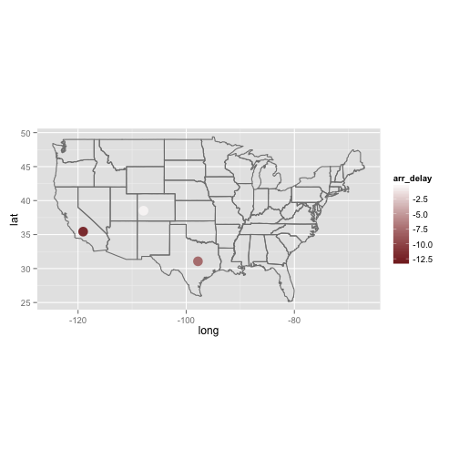 

--- .class #id 

## Seçim Verilerini Toplamak


- Veriler hazır bir şekilde bulunmuyor
- Kendimiz indirip temizlemeliyiz
- http://www.memurlar.net/secim

--- .class #id 

## Veri nerede?

- Web sayfasında görünüyor

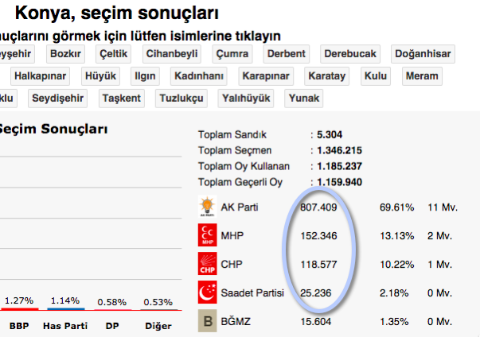

--- .class #id 

## Sayfanın kaynak kodu

- Chrome: Inspect element

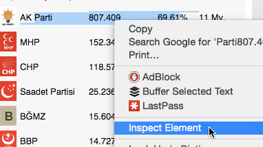

--- .class #id 

## Veri nerede?

- Chrome: inspect element

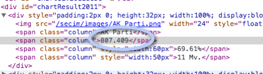

--- .class #id 

## Hangi web sayfalarını indirmeliyiz?

- http://www.memurlar.net/secim/genel/default.aspx?City=tr-01
- http://www.memurlar.net/secim/genel/default.aspx?City=tr-81


```r
	url = sprintf( "http://www.memurlar.net/secim/genel/default.aspx?City=tr-%s", 1)
	url
```

```
## [1] "http://www.memurlar.net/secim/genel/default.aspx?City=tr-1"
```

--- .class #id 

## Url'yi indirmek


```r
	i = 1
	url = sprintf( "http://www.memurlar.net/secim/genel/default.aspx?City=tr-%s", 1)
	filename = sprintf("memurlarnet/%02s.html", i)
	url
```

```
## [1] "http://www.memurlar.net/secim/genel/default.aspx?City=tr-1"
```

```r
	filename
```

```
## [1] "memurlarnet/01.html"
```

```
	download.file( url, destfile = filename, method="wget" )
```

--- .class #id 

## İndirilmiş dosyayı inceleyelim

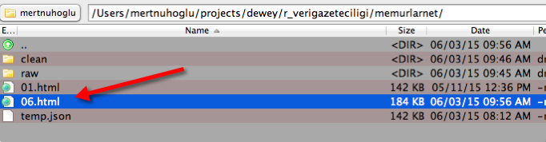

- "chartResult2011" kelimesini aratalım

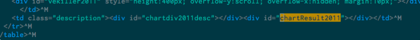

- İçerik boş

--- .class #id 

## Veriler nerede?

- Muhtemelen javascript ile veriler gömülüyor
- Chrome > Inspector > Sources

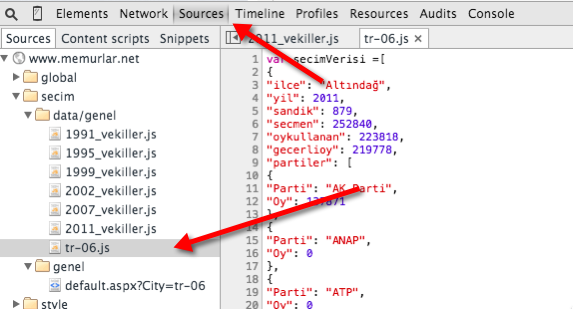

--- .class #id 

## Javascript dosyasının url'si nedir?


- http://www.memurlar.net/secim/data/genel/tr-06.js

--- .class #id 

## Tüm url'leri oluşturalım


```r
	for (i in 1:81) {
		url = sprintf( "http://www.memurlar.net/secim/data/genel/tr-%02s.js", i)
	}
	url
```

```
## [1] "http://www.memurlar.net/secim/data/genel/tr-81.js"
```

--- .class #id 

## Tüm url'leri indirelim

```
	for (i in 1:81) {
		url = sprintf( "http://www.memurlar.net/secim/data/genel/tr-%02s.js", i)
		filename = sprintf("memurlarnet/%02s.json", i)
		download.file( url, destfile = filename, method="wget" )
	}
```

--- .class #id 

## Veriyi okuma

```
	package.install("rlist")
	library("rlist")
```


```r
	filename = sprintf("memurlarnet/raw/%02s.json", 1)
	data = list.load(filename)
```

```
## Error in parseJSON(txt): lexical error: invalid char in json text.
##                                        var secimVerisi = [ {  	"ilce":
##                      (right here) ------^
```

--- .class #id 

## Hatanın nedeni?

- json dosyasının içeriği:

```{js }
	var secimVerisi = [
	{
```

- json sentaksıyla ilgili bir sorun
- şöyle olmalıydı:

```{js }
	{ "secim" : [
	{
```

--- .class #id 

## Bu tür hataların nedenini nasıl bulacağız?

- Bu tür hataları stackoverflow'da sorup çözün
- Bu hatayı sorsanız, en fazla 3 dakika içinde yanıt alırsınız
- Ancak okunabilirlik açısından tüm dosya içeriğini değil, küçük bir kısmını koyun
- İsterseniz, yukarıdaki hatayı sorun ve test edin.

--- .class #id 

## Veri temizleme

- Tüm dosyaları açın
- İlk satırı silin
- Yerine şunu ekleyin:

```
{ "secim": [
```

- Son satıra da şunu ekleyin:

```
}
```

--- .class #id 

## Bu işlemler nasıl otomatikleştirilir?

- Seçenekler:
	- R
	- sed
	- perl
	- vim
- En kolayı: sed

```{sh }
sed '1 d' raw/01.json | sed '1 i\
{ "secim": [
' | sed "$ a\
}
" > clean/01.json
```

--- .class #id 

## Bu scripti nasıl yazacaksınız?

- Stackoverflow'dakilere yazdırın
	- Girdiyi ve istenen çıktıyı net ve kısa olarak yazın
	- Yapılacak işlemleri çok sade bir şekilde yazın
- Çayınızı tazeleyin
- Döndüğünüzde yanıt gelmemişse, hesap sorun: @mertnuhoglu

--- .class #id 

## shell ve R

- Terminal = komut satırı = command prompt = shell = kabuk = ?
- R içinden shell scriptlerini çağırabiliriz


```r
	i = 6
	filename = sprintf("memurlarnet/raw/%02s.json", i)
	cmd = sprintf("./clean_memurlarnet_json.sh %s", filename)
	cmd
```

```
## [1] "./clean_memurlarnet_json.sh memurlarnet/raw/06.json"
```

```
	system(cmd)
```

--- .class #id 

## Tüm dosyalar için shell scripti çağrısı

```
clean_memurlarnet_json_files = function() {
	for (i in 1:81) {
		filename = sprintf("memurlarnet/raw/%02s.json", i)
		cmd = sprintf("./clean_memurlarnet_json.sh %s", filename)
		system(cmd)
	}
}
```

--- .class #id 

## Dosyadaki veriyi yükleme


```r
	filename = sprintf("memurlarnet/clean/%02s.json", 1)
	data = list.load(filename)
```

```
## Warning: The json string is not valid UTF-8. Assuming native encoding.
```

--- .class #id 

## Verinin yapısı (şekli) nedir?

```
	str(data)
```

- Aşırı uzun bir çıktı verir, çünkü hiyerarşik (list türü) veri yapılarını özetlemek zordur

- Json dosyasından inceleyebiliriz
	- Kademe kademe (fold edilebilir) bir metin editörü işe yarar:
	- IntelliJ Idea Community Edition
		https://www.jetbrains.com/idea/download/

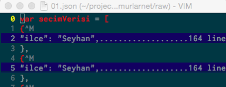

--- .class #id 

## 2. Kademe

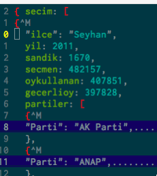

- yil = 2011 olan kayıtları nasıl çekebiliriz?

--- .class #id 

## Veriyi keşfetmek (data exploration)

```
	data %>% str
```


```r
	names(data)
```

```
## [1] "secim"
```

```r
	data$secim %>% names
```

```
## NULL
```

```r
	data$secim %>% length
```

```
## [1] 88
```

- 1. seviyede 88 kayıt var: 
	- Her biri bir ilçe+seçim yılı içeriyor

--- .class #id 

## Seçim yılına göre verileri çekelim


```r
d2011 = data$secim %>%
	list.filter("2011" %in% yil)
length(d2011)
```

```
## [1] 15
```

- 2011 yılına ait 15 farklı ilçenin verisi var

--- .class #id 

## İlçe verisi


```r
d2011[[1]] %>% names
```

```
## [1] "ilce"       "yil"        "sandik"     "secmen"     "oykullanan"
## [6] "gecerlioy"  "partiler"
```

- Bir ilçe verisindeki değişkenler (kolonlar)

--- .class #id 

## Hangi ilçeler var?


```r
list.select(d2011, ilce) %>% unlist
```

```
##             ilce             ilce             ilce             ilce 
##         "Seyhan"  "Y<fc>re<f0>ir"      "Alada<f0>"         "Ceyhan" 
##             ilce             ilce             ilce             ilce 
##    "<c7>ukurova"           "Feke" "<dd>mamo<f0>lu"   "Karaisal<fd>" 
##             ilce             ilce             ilce             ilce 
##     "Karata<fe>"          "Kozan"     "Pozant<fd>"      "Saimbeyli" 
##             ilce             ilce             ilce 
##  "Sar<fd><e7>am"     "Tufanbeyli"  "Yumurtal<fd>k"
```

- Türkçe karakterler bozuk çıkıyor
	- Dosyanın encoding'i ne?
		- iso-8859-9

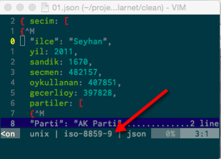

--- .class #id 

## Unicode'a dönüştürme

- Unicode tüm alfabeleri destekleyen evrensel encoding
- Nasıl dönüştürülür?
- Sayısız seçenek var:
	- Vim
	- Shell
	- Notepad2
	- Notepad++
- Unix shell: iconv

```
	iconv -f ISO-8859-9 -t UTF-8 01.json > 01u.json
```


```r
	filename = sprintf("memurlarnet/clean/%02su.json", 1)
	data = list.load(filename)
	d2011 = data$secim %>%
		list.filter("2011" %in% yil)
	d2011[[1]] %>% names
```

```
## [1] "ilce"       "yil"        "sandik"     "secmen"     "oykullanan"
## [6] "gecerlioy"  "partiler"
```

```r
	list.select(d2011, ilce) %>% unlist
```

```
##         ilce         ilce         ilce         ilce         ilce 
##     "Seyhan"    "Yüreğir"     "Aladağ"     "Ceyhan"   "Çukurova" 
##         ilce         ilce         ilce         ilce         ilce 
##       "Feke"   "İmamoğlu"  "Karaisalı"    "Karataş"      "Kozan" 
##         ilce         ilce         ilce         ilce         ilce 
##    "Pozantı"  "Saimbeyli"    "Sarıçam" "Tufanbeyli" "Yumurtalık"
```

--- .class #id 

## Tabloya dönüştürme

- Tüm ilçe verilerini tek bir tabloda birleştirelim


```r
df = d2011 %>% 
	list.select(ilce, yil, sandik, secmen, oykullanan, gecerlioy) %>%
	rbindlist
df
```

```
##           ilce  yil sandik secmen oykullanan gecerlioy
##  1:     Seyhan 2011   1670 482157     407851    397828
##  2:    Yüreğir 2011    961 269449     225279    219153
##  3:     Aladağ 2011     55  11920      10602     10345
##  4:     Ceyhan 2011    422 105790      91781     89820
##  5:   Çukurova 2011    859 249574     216202    212932
##  6:       Feke 2011     69  13064      11006     10578
##  7:   İmamoğlu 2011     82  20518      17770     17360
##  8:  Karaisalı 2011     91  16323      14501     14176
##  9:    Karataş 2011     74  14989      13165     13026
## 10:      Kozan 2011    346  87173      74856     73144
## 11:    Pozantı 2011     65  14353      12780     12501
## 12:  Saimbeyli 2011     56  11657       9280      8992
## 13:    Sarıçam 2011    295  78749      68975     67401
## 14: Tufanbeyli 2011     68  12971      10506     10240
## 15: Yumurtalık 2011     61  13025      11447     11168
```

--- .class #id 

## Tüm yıllara ait veriler için yapalım


```r
df = data$secim %>% 
	list.select(ilce, yil, sandik, secmen, oykullanan, gecerlioy) %>%
	rbindlist
head(df)
```

```
##      ilce  yil sandik secmen oykullanan gecerlioy
## 1: Seyhan 2011   1670 482157     407851    397828
## 2: Seyhan 2007   1870 570517     440323    428998
## 3: Seyhan 2002   2043 562664     412516    396148
## 4: Seyhan 1999   2736 488810     394815    377190
## 5: Seyhan 1995   1502 436945     355731    342748
## 6: Seyhan 1991   1180 354377     275152    265319
```

--- .class #id 

## Tüm şehirlere ait dosyaları toplayıp yapalım


```r
	filenames = sprintf("memurlarnet/clean/%02s.json", 1:81)
	head(filenames)
```

```
## [1] "memurlarnet/clean/01.json" "memurlarnet/clean/02.json"
## [3] "memurlarnet/clean/03.json" "memurlarnet/clean/04.json"
## [5] "memurlarnet/clean/05.json" "memurlarnet/clean/06.json"
```

```r
	dl = llply(filenames, list.load, .progress = "text")
```

```
## 
  |                                                                       
  |                                                                 |   0%
  |                                                                       
  |=                                                                |   1%
  |                                                                       
  |==                                                               |   2%
  |                                                                       
  |==                                                               |   4%
  |                                                                       
  |===                                                              |   5%
  |                                                                       
  |====                                                             |   6%
  |                                                                       
  |=====                                                            |   7%
  |                                                                       
  |======                                                           |   9%
  |                                                                       
  |======                                                           |  10%
  |                                                                       
  |=======                                                          |  11%
  |                                                                       
  |========                                                         |  12%
  |                                                                       
  |=========                                                        |  14%
  |                                                                       
  |==========                                                       |  15%
  |                                                                       
  |==========                                                       |  16%
  |                                                                       
  |===========                                                      |  17%
  |                                                                       
  |============                                                     |  19%
  |                                                                       
  |=============                                                    |  20%
  |                                                                       
  |==============                                                   |  21%
  |                                                                       
  |==============                                                   |  22%
  |                                                                       
  |===============                                                  |  23%
  |                                                                       
  |================                                                 |  25%
  |                                                                       
  |=================                                                |  26%
  |                                                                       
  |==================                                               |  27%
  |                                                                       
  |==================                                               |  28%
  |                                                                       
  |===================                                              |  30%
  |                                                                       
  |====================                                             |  31%
  |                                                                       
  |=====================                                            |  32%
  |                                                                       
  |======================                                           |  33%
  |                                                                       
  |======================                                           |  35%
  |                                                                       
  |=======================                                          |  36%
  |                                                                       
  |========================                                         |  37%
  |                                                                       
  |=========================                                        |  38%
  |                                                                       
  |==========================                                       |  40%
  |                                                                       
  |==========================                                       |  41%
  |                                                                       
  |===========================                                      |  42%
  |                                                                       
  |============================                                     |  43%
  |                                                                       
  |=============================                                    |  44%
  |                                                                       
  |==============================                                   |  46%
  |                                                                       
  |==============================                                   |  47%
  |                                                                       
  |===============================                                  |  48%
  |                                                                       
  |================================                                 |  49%
  |                                                                       
  |=================================                                |  51%
  |                                                                       
  |==================================                               |  52%
  |                                                                       
  |===================================                              |  53%
  |                                                                       
  |===================================                              |  54%
  |                                                                       
  |====================================                             |  56%
  |                                                                       
  |=====================================                            |  57%
  |                                                                       
  |======================================                           |  58%
  |                                                                       
  |=======================================                          |  59%
  |                                                                       
  |=======================================                          |  60%
  |                                                                       
  |========================================                         |  62%
  |                                                                       
  |=========================================                        |  63%
  |                                                                       
  |==========================================                       |  64%
  |                                                                       
  |===========================================                      |  65%
  |                                                                       
  |===========================================                      |  67%
  |                                                                       
  |============================================                     |  68%
  |                                                                       
  |=============================================                    |  69%
  |                                                                       
  |==============================================                   |  70%
  |                                                                       
  |===============================================                  |  72%
  |                                                                       
  |===============================================                  |  73%
  |                                                                       
  |================================================                 |  74%
  |                                                                       
  |=================================================                |  75%
  |                                                                       
  |==================================================               |  77%
  |                                                                       
  |===================================================              |  78%
  |                                                                       
  |===================================================              |  79%
  |                                                                       
  |====================================================             |  80%
  |                                                                       
  |=====================================================            |  81%
  |                                                                       
  |======================================================           |  83%
  |                                                                       
  |=======================================================          |  84%
  |                                                                       
  |=======================================================          |  85%
  |                                                                       
  |========================================================         |  86%
  |                                                                       
  |=========================================================        |  88%
  |                                                                       
  |==========================================================       |  89%
  |                                                                       
  |===========================================================      |  90%
  |                                                                       
  |===========================================================      |  91%
  |                                                                       
  |============================================================     |  93%
  |                                                                       
  |=============================================================    |  94%
  |                                                                       
  |==============================================================   |  95%
  |                                                                       
  |===============================================================  |  96%
  |                                                                       
  |===============================================================  |  98%
  |                                                                       
  |================================================================ |  99%
  |                                                                       
  |=================================================================| 100%
```

```r
	length(dl)
```

```
## [1] 81
```

--- .class #id 

## Her bir ile ait listeyi tabloya çevirelim

- Tek bir ile ait listeyi tabloya çevirmek nasıl?


```r
	dl[[1]][[1]] %>% 
		list.select(ilce, yil, sandik, secmen, oykullanan, gecerlioy) %>%
		rbindlist %>%
		head
```

```
##      ilce  yil sandik secmen oykullanan gecerlioy
## 1: Seyhan 2011   1670 482157     407851    397828
## 2: Seyhan 2007   1870 570517     440323    428998
## 3: Seyhan 2002   2043 562664     412516    396148
## 4: Seyhan 1999   2736 488810     394815    377190
## 5: Seyhan 1995   1502 436945     355731    342748
## 6: Seyhan 1991   1180 354377     275152    265319
```

--- .class #id 

## Tüm iller için bu işlemi uygulama


```r
	dt = dl %>%
		lapply(
			. %>% `[[`('secim') %>%
			list.select(ilce, yil, sandik, secmen, oykullanan, gecerlioy) %>%
			rbindlist
		) %>%
		rbindlist
	tail(dt)
```

```
##        ilce  yil sandik secmen oykullanan gecerlioy
## 1: Kaynaşlı 2011     64  14580      13244     12990
## 2: Kaynaşlı 2007     50  12992      11723     11504
## 3: Kaynaşlı 2002     58  11927      10487     10185
## 4:  Yığılca 2011     64  12202      11169     10897
## 5:  Yığılca 2007     56  13316      12061     11779
## 6:  Yığılca 2002     69  13339      11725     11325
```

--- .class #id 

## Partilerin oy verilerini nasıl çekeceğiz?

- Şu ana değin hep tek kademeli verileri işledik
- Parti oyları bir alt kademede saklı

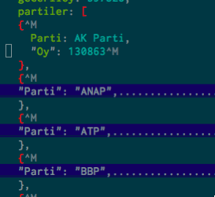

--- .class #id 

## Partilerin oy verilerini çekme

- Önce tek bir il için yapalım


```r
	d2011[[1]] %>% names
```

```
## [1] "ilce"       "yil"        "sandik"     "secmen"     "oykullanan"
## [6] "gecerlioy"  "partiler"
```

```r
	pl = d2011 %>% 
		list.select(partiler)
	length(pl)
```

```
## [1] 15
```

- Adana'nın 15 ilçesi

- İlk ilçenin parti oyları:


```r
pl[[1]][[1]] %>% str
```

```
## List of 39
##  $ :List of 2
##   ..$ Parti: chr "AK Parti"
##   ..$ Oy   : int 130863
##  $ :List of 2
##   ..$ Parti: chr "ANAP"
##   ..$ Oy   : int 0
##  $ :List of 2
##   ..$ Parti: chr "ATP"
##   ..$ Oy   : int 0
##  $ :List of 2
##   ..$ Parti: chr "BBP"
##   ..$ Oy   : int 2421
##  $ :List of 2
##   ..$ Parti: chr "BP"
##   ..$ Oy   : int 0
##  $ :List of 2
##   ..$ Parti: chr "BTP"
##   ..$ Oy   : int 0
##  $ :List of 2
##   ..$ Parti: chr "CHP"
##   ..$ Oy   : int 137511
##  $ :List of 2
##   ..$ Parti: chr "DBP"
##   ..$ Oy   : int 0
##  $ :List of 2
##   ..$ Parti: chr "DEHAP"
##   ..$ Oy   : int 0
##  $ :List of 2
##   ..$ Parti: chr "DEPAR"
##   ..$ Oy   : int 0
##  $ :List of 2
##   ..$ Parti: chr "DP"
##   ..$ Oy   : int 1907
##  $ :List of 2
##   ..$ Parti: chr "DSP"
##   ..$ Oy   : int 755
##  $ :List of 2
##   ..$ Parti: chr "DTP"
##   ..$ Oy   : int 0
##  $ :List of 2
##   ..$ Parti: chr "DYP"
##   ..$ Oy   : int 539
##  $ :List of 2
##   ..$ Parti: chr "EMEP"
##   ..$ Oy   : int 0
##  $ :List of 2
##   ..$ Parti: chr "FP"
##   ..$ Oy   : int 0
##  $ :List of 2
##   ..$ Parti: chr "Genç Parti"
##   ..$ Oy   : int 0
##  $ :List of 2
##   ..$ Parti: chr "HADEP"
##   ..$ Oy   : int 0
##  $ :List of 2
##   ..$ Parti: chr "HEPAR"
##   ..$ Oy   : int 699
##  $ :List of 2
##   ..$ Parti: chr "Has Parti"
##   ..$ Oy   : int 1269
##  $ :List of 2
##   ..$ Parti: chr "HYP"
##   ..$ Oy   : int 0
##  $ :List of 2
##   ..$ Parti: chr "İP"
##   ..$ Oy   : int 0
##  $ :List of 2
##   ..$ Parti: chr "LDP"
##   ..$ Oy   : int 114
##  $ :List of 2
##   ..$ Parti: chr "MHP"
##   ..$ Oy   : int 60289
##  $ :List of 2
##   ..$ Parti: chr "MMP"
##   ..$ Oy   : int 250
##  $ :List of 2
##   ..$ Parti: chr "Millet Partisi"
##   ..$ Oy   : int 715
##  $ :List of 2
##   ..$ Parti: chr "ÖDP"
##   ..$ Oy   : int 0
##  $ :List of 2
##   ..$ Parti: chr "RP"
##   ..$ Oy   : int 0
##  $ :List of 2
##   ..$ Parti: chr "Saadet Partisi"
##   ..$ Oy   : int 4261
##  $ :List of 2
##   ..$ Parti: chr "SHP"
##   ..$ Oy   : int 0
##  $ :List of 2
##   ..$ Parti: chr "SİP"
##   ..$ Oy   : int 0
##  $ :List of 2
##   ..$ Parti: chr "SP"
##   ..$ Oy   : int 0
##  $ :List of 2
##   ..$ Parti: chr "TKP"
##   ..$ Oy   : int 517
##  $ :List of 2
##   ..$ Parti: chr "YDH"
##   ..$ Oy   : int 0
##  $ :List of 2
##   ..$ Parti: chr "YDP"
##   ..$ Oy   : int 0
##  $ :List of 2
##   ..$ Parti: chr "Yeni Parti"
##   ..$ Oy   : int 0
##  $ :List of 2
##   ..$ Parti: chr "YP"
##   ..$ Oy   : int 0
##  $ :List of 2
##   ..$ Parti: chr "YTP"
##   ..$ Oy   : int 0
##  $ :List of 2
##   ..$ Parti: chr "BĞMZ"
##   ..$ Oy   : int 55718
```

--- .class #id 

## Tek bir ilçedeki verileri tabloya çevirmek


```r
	pt_ilce = pl[[1]][[1]] %>%
		rbindlist
	head(pt_ilce)
```

```
##       Parti     Oy
## 1: AK Parti 130863
## 2:     ANAP      0
## 3:      ATP      0
## 4:      BBP   2421
## 5:       BP      0
## 6:      BTP      0
```

--- .class #id 

## Tüm ilçeler için bunu yapalım


```r
	pt_ilceler = llply(pl, 
			. %>%
			`[[`('partiler') %>%
			rbindlist
		) 
	length(pt_ilceler)
```

```
## [1] 15
```

```r
	head(pt_ilceler[[1]])
```

```
##       Parti     Oy
## 1: AK Parti 130863
## 2:     ANAP      0
## 3:      ATP      0
## 4:      BBP   2421
## 5:       BP      0
## 6:      BTP      0
```

- Bu bir list of data.table
- Tüm list elementlerini birleştirelim

--- .class #id 

## Tüm ilçelerin tablolarını birleştirme

- Aşağıdaki sorun ne?


```r
	pt = llply(pl, 
			. %>%
			`[[`('partiler') %>%
			rbindlist
		) %>%
		rbindlist
	nrow(pt)
```

```
## [1] 585
```

```r
	tail(pt)
```

```
##         Parti Oy
## 1:        YDH  0
## 2:        YDP  0
## 3: Yeni Parti  0
## 4:         YP  0
## 5:        YTP  0
## 6:       BĞMZ 40
```

--- .class #id 

## Sorun: hangi veri hangi ilçeye ait?


```r
	pt_ilceler[[1]]$ilce = 'Saimbeyli'
	head(pt_ilceler[[1]])
```

```
##       Parti     Oy      ilce
## 1: AK Parti 130863 Saimbeyli
## 2:     ANAP      0 Saimbeyli
## 3:      ATP      0 Saimbeyli
## 4:      BBP   2421 Saimbeyli
## 5:       BP      0 Saimbeyli
## 6:      BTP      0 Saimbeyli
```

- Bunu tüm ilçelerde yapmalıyız

--- .class #id 

## Linkler

- Html5 slaytlar ve kaynak kodları: https://github.com/mertnuhoglu/r_verigazeteciligi
 - https://dl.dropboxusercontent.com/u/103580364/r_verigazeteciligi/index.html#1
- [Veribilimi İstanbul](https://www.facebook.com/groups/465842350233183/)
- [RStudio Webinars](http://www.rstudio.com/resources/webinars/)
- İletişim bilgilerim:
 - http://twitter.com/mertnuhoglu
 - mert.nuhoglu@gmail.com


